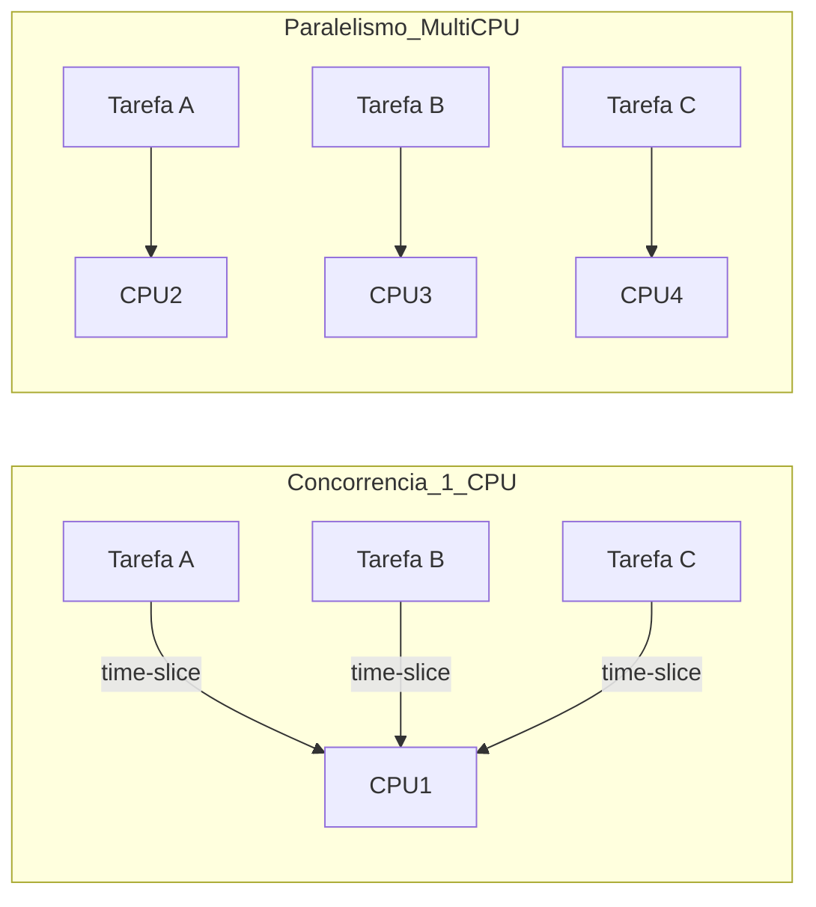
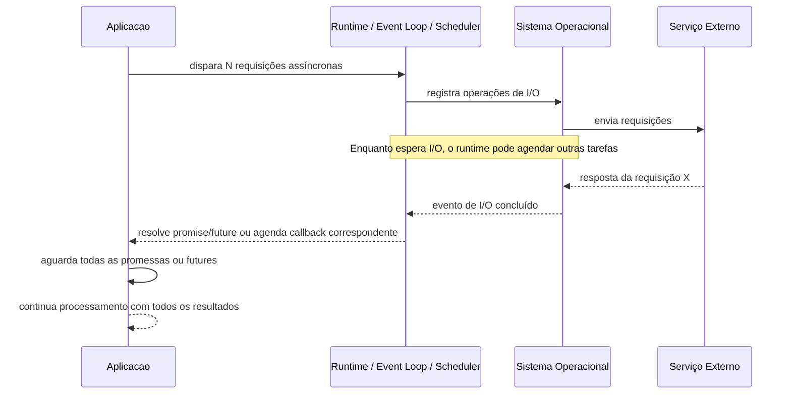
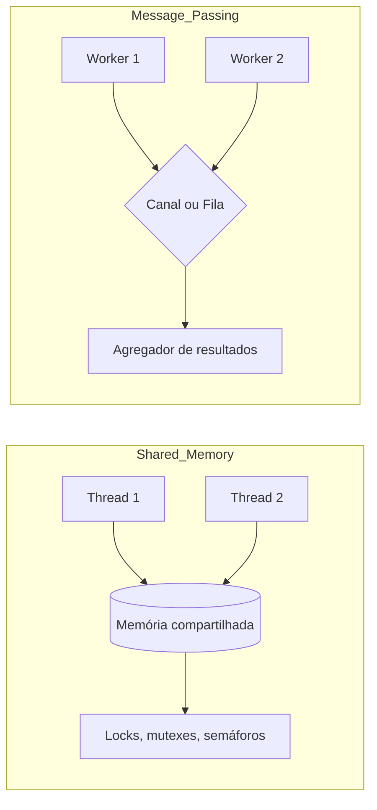

# 🧵 Concorrência vs Paralelismo

| Data | Apresentador |
|-:|:-|
| 10/12/2025 19:00 | [Ruan Pato](https://ruanpato.com) |

## Sumário

- [🧵 Concorrência vs Paralelismo](#-concorrência-vs-paralelismo)
  - [Sumário](#sumário)
  - [🧭 1. Objetivo do Encontro](#-1-objetivo-do-encontro)
  - [⚡ 2. Concorrência vs Paralelismo](#-2-concorrência-vs-paralelismo)
    - [🔁 2.1 Concorrência](#-21-concorrência)
    - [🧩 2.2 Paralelismo](#-22-paralelismo)
  - [🧱 3. Tipos de Workload e desafios](#-3-tipos-de-workload-e-desafios)
    - [🧮 3.1 CPU-bound](#-31-cpu-bound)
    - [🌐 3.2 I/O-bound](#-32-io-bound)
    - [💾 3.3 Memory-bound](#-33-memory-bound)
    - [⚙️ 3.4 Cache-bound](#️-34-cache-bound)
    - [🧠 3.5 Relação com concorrência e paralelismo](#-35-relação-com-concorrência-e-paralelismo)
    - [⏱️ 3.6 Troca de contexto (context switching)](#️-36-troca-de-contexto-context-switching)
    - [🤝 3.7 Memória compartilhada vs troca de mensagens](#-37-memória-compartilhada-vs-troca-de-mensagens)
    - [🧨 3.8 Problemas clássicos de concorrência e quando paralelizar piora](#-38-problemas-clássicos-de-concorrência-e-quando-paralelizar-piora)
    - [🛠️ 3.9 Exemplos práticos de uso em backend e ML](#️-39-exemplos-práticos-de-uso-em-backend-e-ml)
  - [📈 4. Diagramas MMD](#-4-diagramas-mmd)
    - [🔀 4.1 Concorrência vs paralelismo em alto nível](#-41-concorrência-vs-paralelismo-em-alto-nível)
    - [🌪️ 4.2 Fluxo de requests concorrentes](#️-42-fluxo-de-requests-concorrentes)
    - [🧵 4.3 Pool de concorrência: Node.js vs Go](#-43-pool-de-concorrência-nodejs-vs-go)
    - [🔐 4.4 Memória compartilhada vs mensagens](#-44-memória-compartilhada-vs-mensagens)
  - [🧪 5. O benchmark comum](#-5-o-benchmark-comum)
    - [🎯 5.1 Problema](#-51-problema)
      - [▶️🏠 5.1.1 Executando Local](#️-511-executando-local)
      - [▶️📦 5.1.2 Executando em Container](#️-512-executando-em-container)
    - [🧵 5.2 Modos de execução](#-52-modos-de-execução)
  - [🧵 6. Como cada linguagem lida com concorrência e paralelismo](#-6-como-cada-linguagem-lida-com-concorrência-e-paralelismo)
    - [🟦 6.1 Node.js](#-61-nodejs)
      - [🔄 6.1.1 Event loop e libuv](#-611-event-loop-e-libuv)
      - [📦 6.1.2 Promises, pools de concorrência e o exemplo dos "20 slots"](#-612-promises-pools-de-concorrência-e-o-exemplo-dos-20-slots)
      - [🧵 6.1.3 Worker threads e processos](#-613-worker-threads-e-processos)
      - [⚠️ 6.1.4 Erros, observabilidade e legibilidade em Node](#️-614-erros-observabilidade-e-legibilidade-em-node)
    - [🐍 6.2 Python](#-62-python)
      - [🔐 6.2.1 GIL: o bloqueio global do interpretador](#-621-gil-o-bloqueio-global-do-interpretador)
      - [⏱️ 6.2.2 asyncio](#️-622-asyncio)
      - [🧵 6.2.3 ThreadPoolExecutor](#-623-threadpoolexecutor)
      - [🧬 6.2.4 ProcessPoolExecutor e multiprocessing](#-624-processpoolexecutor-e-multiprocessing)
      - [🧪 6.2.5 No-GIL e o futuro](#-625-no-gil-e-o-futuro)
      - [⚠️ 6.2.6 Erros, observabilidade e legibilidade em Python](#️-626-erros-observabilidade-e-legibilidade-em-python)
    - [🟨 6.3 Go](#-63-go)
      - [🧵 6.3.1 Goroutines](#-631-goroutines)
      - [📡 6.3.2 Scheduler M:N e GOMAXPROCS](#-632-scheduler-mn-e-gomaxprocs)
      - [📬 6.3.3 Channels e CSP](#-633-channels-e-csp)
      - [🧵 6.3.4 Pools de workers em Go](#-634-pools-de-workers-em-go)
      - [⚠️ 6.3.5 Erros, observabilidade e legibilidade em Go](#️-635-erros-observabilidade-e-legibilidade-em-go)
    - [📊 6.4 Comparação entre os modelos](#-64-comparação-entre-os-modelos)
  - [🚀 7. Execução dos benchmarks e boas práticas](#-7-execução-dos-benchmarks-e-boas-práticas)
    - [⚙️ 7.1 Fluxo recomendado para rodar os testes](#️-71-fluxo-recomendado-para-rodar-os-testes)
    - [🧾 7.2 Tratamento de erros](#-72-tratamento-de-erros)
    - [👀 7.3 Observabilidade](#-73-observabilidade)
    - [🧹 7.4 Legibilidade e manutenção](#-74-legibilidade-e-manutenção)
  - [📚 8. Referências](#-8-referências)
    - [📚 8.1 Conceitos gerais de concorrência vs paralelismo](#-81-conceitos-gerais-de-concorrência-vs-paralelismo)
    - [📚 8.2 JavaScript e Node.js](#-82-javascript-e-nodejs)
    - [📚 8.3 Python (GIL, asyncio, multiprocessing, no-GIL)](#-83-python-gil-asyncio-multiprocessing-no-gil)
    - [📚 8.4 Go (goroutines, channels, CSP, scheduler)](#-84-go-goroutines-channels-csp-scheduler)
    - [📚 8.5 Sistemas operacionais e base teórica](#-85-sistemas-operacionais-e-base-teórica)
    - [📚 8.6 Problemas clássicos de concorrência e sincronização](#-86-problemas-clássicos-de-concorrência-e-sincronização)
    - [📚 8.7 CPU-bound, I/O-bound, memory-bound, cache-bound](#-87-cpu-bound-io-bound-memory-bound-cache-bound)
    - [📚 8.8 Observabilidade, profiling e ferramentas](#-88-observabilidade-profiling-e-ferramentas)
    - [📚 8.9 Benchmarks](#-89-benchmarks)
    - [📚 8.10 LGC](#-810-lgc)

---

## 🧭 1. Objetivo do Encontro

Comparar, de forma prática e conceitual, como **Node.js**, **Python (com e sem GIL)** e **Go** lidam com **concorrência** e **paralelismo**, usando um mesmo problema CPU-bound (contagem e soma de números primos) em três modos de execução:

1. Sequencial  
2. Concorrente sem paralelismo real de CPU  
3. Paralelo usando múltiplos núcleos

Foco do encontro:

- [ ] Entender claramente o que é concorrência e o que é paralelismo  
- [ ]Relacionar esses conceitos com workloads CPU-bound, I/O-bound, memory-bound e cache-bound  
- [ ] Entender o modelo de execução de cada linguagem e como ela trata erros, gargalos, observabilidade e legibilidade  
- [ ] Sair com intuição de nível enterprise para tomar decisões em sistemas reais de backend e ML

---

## ⚡ 2. Concorrência vs Paralelismo

### 🔁 2.1 Concorrência

Concorrência é a forma de organizar o programa para lidar com múltiplas tarefas em progresso ao mesmo tempo, mesmo que em um único núcleo a execução de fato seja intercalada.

Características principais:

- Estrutura o código em tarefas independentes e muitas vezes composíveis
- Aproveita bem o tempo ocioso de I/O
- Brilha em cenários de alta latência externa (APIs, banco, disco, filas)
- Pode ou não envolver múltiplos núcleos

### 🧩 2.2 Paralelismo

Paralelismo é executar tarefas ao mesmo tempo em núcleos diferentes.

Características principais:

- Focado em reduzir o tempo total de execução de workloads CPU-bound
- Normalmente usa múltiplas threads ou processos mapeados para múltiplos núcleos
- Traz desafios adicionais: sincronização, contenção de locks, uso de cache, coordenação
- Nem sempre vale a pena, pois o overhead de sincronização pode matar o ganho

Concorrência é uma questão de estrutura de software. Paralelismo é uma questão de execução física em múltiplos núcleos. Dá para ter concorrência sem paralelismo e paralelismo sem um modelo de concorrência bem pensado.

---

## 🧱 3. Tipos de Workload e desafios

### 🧮 3.1 CPU-bound

- O gargalo é o processamento
- Se a CPU ficasse mais rápida (ou tivéssemos mais núcleos) o tempo total diminuiria de forma quase proporcional  
- Exemplos:
  - Criptografia
  - Compressão pesada
  - Simulações numéricas
  - Cálculo de números primos

### 🌐 3.2 I/O-bound

- O gargalo é rede, disco ou outro tipo de I/O
- A CPU fica parte do tempo esperando dados chegarem
- Exemplos:
  - Chamadas a APIs externas
  - Acesso a banco de dados remoto
  - ETL que faz muitas leituras e escritas

### 💾 3.3 Memory-bound

- Limitado pela largura de banda ou latência de acesso à memória RAM
- A CPU até teria ciclos disponíveis, mas passa boa parte do tempo esperando dados da memória
- Muito comum em workloads de análise de dados e ML em larga escala

### ⚙️ 3.4 Cache-bound

- Limitado pelo tamanho e pela hierarquia de cache (L1, L2, L3)
- Quando o working set não cabe no cache, a CPU frequentemente precisa buscar dados na RAM
- Acesso desorganizado à memória piora bastante este cenário

### 🧠 3.5 Relação com concorrência e paralelismo

| Tipo de workload | Concorrência | Paralelismo |
|------------------|-------------|------------|
| CPU-bound        | Ajuda pouco, se tudo roda em um núcleo | Essencial para escalar |
| I/O-bound        | Traz ganhos grandes, pois usa o tempo ocioso | Nem sempre faz diferença |
| Memory-bound     | Depende da organização de acesso à memória | Pode piorar se gerar mais contenção |
| Cache-bound      | Pouco efeito direto | Pode ajudar ou atrapalhar, depende da localidade |

Em sistemas reais, muitas vezes ocorre uma mistura dos quatro tipos.

---

### ⏱️ 3.6 Troca de contexto (context switching)

Troca de contexto acontece quando o sistema operacional ou o runtime pausa uma tarefa e continua outra. Isso envolve:

- Salvar registradores
- Atualizar estruturas internas do escalonador
- Possível perda de dados quentes na cache

Excesso de concorrência, com muitas threads ou goroutines ativas, pode levar a:

- Overhead alto de context switching
- Perda de cache locality
- Menos throughput do que uma solução mais simples

Em workloads CPU-bound, aumentar demais o número de threads ou goroutines geralmente piora a performance.

---

### 🤝 3.7 Memória compartilhada vs troca de mensagens

Dois estilos principais para coordenar tarefas:

1. Memória compartilhada com locks
   - Várias threads acessam a mesma estrutura de dados
   - Usa mutexes, locks de leitura, semáforos e estruturas similares
   - É comum em muitas linguagens, mas fácil de errar

2. Troca de mensagens  
   - Cada worker ou componente tem seu próprio estado e se comunica via filas, canais ou mensagens
   - Reduz a chance de condições de corrida, mas muda o estilo de modelagem
   - Go incentiva fortemente este modelo com channels e CSP
   - Arquiteturas de filas e mensageria em sistemas distribuídos seguem a mesma ideia

---

### 🧨 3.8 Problemas clássicos de concorrência e quando paralelizar piora

Problemas comuns:

- Race conditions: duas tarefas acessam ou modificam estado compartilhado sem coordenação adequada
- Deadlocks: conjunto de tarefas esperando recursos umas das outras, ninguém progride
- Starvation: uma tarefa nunca recebe tempo de CPU ou acesso ao recurso
- Lock contention: threads demais disputando o mesmo lock reduzem o throughput
- False sharing: variáveis independentes na mesma cache line fazem várias CPUs brigarem na mesma região de memória
- Oversubscription: criar mais threads do que núcleos, gerando overhead excessivo de escalonamento

Quando paralelizar piora:

- Workload fortemente memory-bound ou cache-bound
- Workload pequeno, em que o custo de criar threads, processos ou workers é maior do que o trabalho em si
- Cenários com muito compartilhamento de dados, sem um desenho de concorrência adequado

---

### 🛠️ 3.9 Exemplos práticos de uso em backend e ML

Onde concorrência é muito útil:

- Várias consultas independentes ao banco de dados (por exemplo, montar uma tela agregando dados de múltiplas tabelas ou serviços)
- Chamadas independentes a APIs de terceiros, quando não há endpoint de batch
- Consumo de filas com múltiplos workers, cada um processando mensagens de forma idempotente
- Pipelines de processamento em ETL, streaming e ML (ler, transformar, escrever em estágios concorrentes)

Onde multithreading ou multiprocessos é comum:

- Backend com lógica de negócio CPU-bound pesada (criptografia, compressão, transformação de grandes volumes em memória)
- Serviços de scoring de ML que fazem muita computação por requisição
- Pipelines de pré-processamento de dados de treino, conversão de arquivos e geração de features
- Ferramentas de linha de comando que processam muitos arquivos em paralelo

---

## 📈 4. Diagramas MMD

### 🔀 4.1 Concorrência vs paralelismo em alto nível



### 🌪️ 4.2 Fluxo de requests concorrentes



### 🧵 4.3 Pool de concorrência: Node.js vs Go

```mermaid
flowchart TB
    subgraph Node_js
        NQ[Fila de tarefas HTTP] --> NPool[Promise pool com limite de 20]
        NPool -->|até 20 chamadas em voo| NIO[I/O externo]
        NIO --> NPool
        NPool --> NDone[Resultados acumulados]
    end

    subgraph Go
        GQ[Channel de tarefas] --> GWorkers[[20 goroutines workers]]
        GWorkers --> GIO[I/O externo]
        GIO --> GWorkers
        GWorkers --> GDone[Resultados acumulados]
    end

    note right of Node_js: Com chunks simples de 20 e Promise.all,<br>uma chamada muito lenta pode segurar o próximo chunk.
    note right of Go: Com pool de workers, assim que um worker termina,<br>ele pega uma nova tarefa do channel.
```

### 🔐 4.4 Memória compartilhada vs mensagens



---

## 🧪 5. O benchmark comum

### 🎯 5.1 Problema

Usaremos o mesmo problema CPU-bound em todas as linguagens:

- Gerar um array de N inteiros pseudoaleatórios em um intervalo fixo usando um LCG (Linear congruential generator) determinístico
- Contar quantos números são primos
- Calcular a soma desses números primos

Gerador LCG em pseudo código:

```text
seed = 42
seed = (seed * 1664525 + 1013904223) & 0xFFFFFFFF
value = 100000 + (seed % 900000)
```

#### ▶️🏠 5.1.1 Executando Local

**Pré-requisitos:**

- Go instalado (go version)
- Node 20+ instalado (node -v)
- Python 3.11+ instalado (python3 --version ou equivalente)
- Docker não é necessário para este modo

```bash
# Dar permissão de execução pros scripts
chmod +x scripts/setup_local_env.sh
chmod +x scripts/run_benchmarks.sh

# 1) Preparar ambiente (Go modules, npm install, venv do Python)
./scripts/setup_local_env.sh

# Ganho inferior a overhead
N=200000 WORKERS=4 ./scripts/run_benchmarks.sh
# Caso de ganho perceptivel
N=5000000 WORKERS=8 ./scripts/run_benchmarks.sh
# Vários minutos
N=10000000 WORKERS=8 ./scripts/run_benchmarks.sh
```

#### ▶️📦 5.1.2 Executando em Container


```bash
# Permissão pros scripts
chmod +x scripts/build_images.sh
chmod +x scripts/run_benchmarks_docker.sh

# 1) Buildar as imagens
./scripts/build_images.sh

# 2) Rodar todos os benchmarks via Docker (resultados em ./results)
N=100000 WORKERS=4 ./scripts/run_benchmarks_docker.sh

# Exemplos com parâmetros diferentes
N=300000 WORKERS=8 ./scripts/run_benchmarks_docker.sh
```

### 🧵 5.2 Modos de execução

Em cada linguagem teremos três modos:

| Linguagem | Sequencial | Concorrente (sem paralelismo real) | Paralelo |
|-----------|------------|--------------------------------------|----------|
| Node.js   | loop simples | Promise pool no mesmo event loop | worker_threads ou processos |
| Python    | loop simples | ThreadPoolExecutor com GIL | ProcessPoolExecutor ou multiprocessing |
| Go        | loop simples | goroutines com GOMAXPROCS igual a 1 | goroutines com GOMAXPROCS igual ao número de CPUs |

Cada script deve imprimir algo como:

```json
{
  "language": "node",
  "mode": "parallel",
  "N": 1000000,
  "workers": 8,
  "prime_count": 7649,
  "prime_sum": 4116688679,
  "elapsed_seconds": 0.2712
}
```

---

## 🧵 6. Como cada linguagem lida com concorrência e paralelismo

### 🟦 6.1 Node.js

#### 🔄 6.1.1 Event loop e libuv

- O JavaScript em Node é, por padrão, single-threaded para o código de aplicação  
- O event loop coordena timers, callbacks, I/O assíncrono, microtasks e promessas  
- Operações de I/O intensivo são delegadas para um threadpool interno (libuv), que faz o trabalho e depois notifica o event loop  

Consequência prática:

- Para workloads I/O-bound, Node escala muito bem com um único processo  
- Para workloads CPU-bound pesados, o event loop pode ficar bloqueado e o servidor parar de responder  

#### 📦 6.1.2 Promises, pools de concorrência e o exemplo dos "20 slots"

Formas comuns de usar concorrência em Node:

- Promise.all com uma lista de promises  
- Promise.allSettled quando é importante capturar erros e sucessos sem abortar tudo  
- Bibliotecas de promise pool ou implementação manual de um pool  

Um padrão comum em Node:

- Você tem uma lista grande de tarefas independentes, como chamadas para APIs externas  
- Em vez de disparar tudo de uma vez, você processa com um limite, por exemplo, 20 chamadas em paralelo  

Dois jeitos principais de implementar isso:

1. Chunk simples com Promise.all  
   - Quebra a lista em blocos de 20  
   - Roda Promise.all em cada bloco  
   - Problema: se uma das 20 demorar muito, a próxima leva de 20 só começa depois que a mais lenta do bloco atual terminar  

2. Pool de concorrência de verdade  
   - Mantém uma fila de tarefas  
   - Mantém um conjunto de até 20 promises em voo  
   - Assim que uma promise termina, a próxima tarefa entra imediatamente no lugar  
   - Dessa forma, você tem sempre até 20 requisições concorrentes em voo, sem ficar preso ao tempo do bloco mais lento  

Este segundo modelo é o mais adequado quando você quer um comportamento parecido com um pool de workers. Conceitualmente ele é bem próximo ao padrão de worker pool em Go.

#### 🧵 6.1.3 Worker threads e processos

Para CPU-bound, é necessário sair do event loop:

- worker_threads  
  - Permitem usar múltiplos núcleos com threads de JavaScript  
  - Cada worker tem seu próprio event loop e heap  
  - Comunicação feita por mensagens e, opcionalmente, buffers compartilhados  

- Processos (cluster, child_process)  
  - Cada processo tem sua própria memória e runtime Node  
  - Dá isolamento mais forte, mas tem custo maior de memória e comunicação  

Padrão comum em produção:

- Processos para escalar servidores web  
- Worker threads para tarefas de CPU específicas (hashing, compressão, renderização, transformação de arquivos grandes)  

#### ⚠️ 6.1.4 Erros, observabilidade e legibilidade em Node

Boas práticas em ambiente enterprise:

- Tratar rejeições de promises de forma consistente (Promise.allSettled, try/await com captura centralizada, handlers globais para unhandled rejections)  
- Usar logging estruturado (por exemplo, pino) e correlação de requests por id  
- Integrar com OpenTelemetry ou ferramentas similares para métricas, traces e logs  
- Medir o atraso do event loop para detectar quando código CPU-bound está travando o servidor  
- Isolar partes CPU-bound em workers dedicados, com contrato claro de entrada e saída  
- Evitar aninhamentos profundos de callbacks e promessas, preferindo funções bem nomeadas e fluxos lineares com async/await  

---

### 🐍 6.2 Python

#### 🔐 6.2.1 GIL: o bloqueio global do interpretador

- O CPython possui o GIL, que permite apenas que uma thread execute bytecode Python por vez  
- Para workloads CPU-bound, várias threads em Python não conseguem escalar bem para múltiplos núcleos  
- Para workloads I/O-bound, threads podem ajudar, especialmente quando o tempo é gasto esperando operações externas ou bibliotecas nativas que liberam o GIL  

#### ⏱️ 6.2.2 asyncio

- asyncio provê um event loop, tasks e futures  
- Modelo conceitualmente parecido com Node: cooperativo, orientado a eventos  
- Brilha em serviços que fazem muitas chamadas HTTP, acessos a banco assíncronos e operações com alto volume de I/O  
- Em código real de backend, é comum combinar asyncio com bibliotecas assíncronas de banco, cache e mensageria  

#### 🧵 6.2.3 ThreadPoolExecutor

- Usa threads do sistema operacional por baixo  
- Útil quando se tem muitas chamadas bloqueantes que não são assíncronas, como bibliotecas de banco antigas ou SDKs que ainda não oferecem interface async  
- Para CPU-bound, o GIL limita o ganho; geralmente não é a solução ideal para paralelismo  

#### 🧬 6.2.4 ProcessPoolExecutor e multiprocessing

- Cria múltiplos processos, cada um com sua própria instância de Python  
- Permite paralelizar workloads CPU-bound em múltiplos núcleos  
- Tem custo de serialização e IPC, por isso é mais vantajoso quando cada tarefa faz trabalho significativo  

Este padrão aparece muito em:

- ETL pesadas  
- Pré-processamento de datasets para ML  
- Ferramentas que processam muitos arquivos ou imagens  

#### 🧪 6.2.5 No-GIL e o futuro

- A proposta de tornar o GIL opcional está em desenvolvimento (PEP 703)  
- A ideia é permitir que threads consigam paralelizar CPU-bound de forma real, usando múltiplos núcleos  
- Ainda é cenário em evolução, mas é importante conhecer, especialmente para quem trabalha com ML e ciência de dados  

#### ⚠️ 6.2.6 Erros, observabilidade e legibilidade em Python

Boas práticas:

- Usar o módulo logging com handlers apropriados, em vez de prints soltos  
- Em asyncio, sempre tratar tasks que podem falhar e evitar tasks "perdidas" sem await  
- Em multiprocessos, lidar explicitamente com timeouts e exceções que acontecem nos workers  
- Em pipelines de ML, registrar quais itens falharam, com qual exceção e se podem ser reprocessados  
- Integrar com ferramentas de observabilidade para ter métricas de tempo, filas, uso de CPU e memória por processo  
- Documentar bem a diferença entre caminhos sequenciais, concorrentes e paralelos do código  

---

### 🟨 6.3 Go

#### 🧵 6.3.1 Goroutines

- São unidades de execução muito leves, gerenciadas pelo runtime de Go  
- Podem ser criadas em grande quantidade sem o custo de threads tradicionais  
- São multiplexadas em poucas threads do sistema operacional  

#### 📡 6.3.2 Scheduler M:N e GOMAXPROCS

- O runtime de Go implementa um agendador M:N que relaciona goroutines em threads do sistema operacional  
- runtime.GOMAXPROCS controla quantas threads podem executar goroutines em paralelo  
- Com GOMAXPROCS igual a 1, temos concorrência sem paralelismo real de CPU  
- Com GOMAXPROCS igual ao número de CPUs, goroutines podem rodar em paralelo  

#### 📬 6.3.3 Channels e CSP

- Channels são a forma padrão de comunicação entre goroutines  
- O modelo de CSP encoraja troca de mensagens em vez de compartilhamento de memória  
- É possível usar mutexes e locks, mas o estilo idiomático de Go tende a preferir canais para coordenação de workers  
- Este modelo fica muito próximo de modelos de mensageria em sistemas distribuídos  

#### 🧵 6.3.4 Pools de workers em Go

Padrão comum para limitar a concorrência:

- Criar um conjunto de goroutines workers (por exemplo, 20)  
- Enviar tarefas em um channel  
- Cada worker consome uma tarefa, processa e volta a ler do channel  
- Enquanto houver tarefas e workers livres, o sistema se ajusta automaticamente  

Este padrão é conceitualmente muito próximo de um promise pool bem implementado em Node, com a diferença de que o compilador e o runtime de Go já foram desenhados com este estilo em mente.

#### ⚠️ 6.3.5 Erros, observabilidade e legibilidade em Go

Boas práticas:

- Usar o padrão de retorno de error de forma consistente, sem engolir erros  
- Propagar contexto de cancelamento com context.Context em requisições concorrentes  
- Usar pprof e ferramentas de profiling para identificar goroutines presas, vazamentos e hotspots  
- Exportar métricas com Prometheus ou OpenTelemetry  
- Evitar criar goroutines sem controle, sempre ter um plano claro de onde elas terminam  
- Manter contratos claros entre produtores e consumidores de channels, com fechamento bem definido  

---

### 📊 6.4 Comparação entre os modelos

| Tema                         | Node.js                             | Python                                             | Go                                               |
|------------------------------|-------------------------------------|----------------------------------------------------|--------------------------------------------------|
| Modelo base                  | Event loop e libuv                  | GIL, threads, asyncio e processos                  | Scheduler M:N com goroutines e channels          |
| Concorrência para I/O        | Muito forte                         | Muito forte com asyncio e threads                  | Muito forte e barata com goroutines              |
| Paralelismo CPU-bound        | Worker threads ou processos         | Processos (multiprocessing, ProcessPoolExecutor)   | Goroutines com GOMAXPROCS maior que 1            |
| Estilo de sincronização      | Callbacks, promises, event loop     | Locks, futures, processos, filas                   | Channels, context e mutexes quando necessário    |
| Custo de unidade leve        | Promise ou future                   | Coroutine asyncio ou thread                        | Goroutine                                        |
| Melhor cenário típico        | APIs I/O-bound, gateways, proxies   | ETL, automação, ML backend misto I/O e CPU         | Serviços de alta performance e pipelines complexos |
| Observabilidade              | Ferramentas APM, métricas de loop   | Logging estruturado, tracing, métricas             | pprof, métricas, tracing                         |

---

## 🚀 7. Execução dos benchmarks e boas práticas

### ⚙️ 7.1 Fluxo recomendado para rodar os testes

1. Definir o valor de N, por exemplo 1 000 000  
2. Definir um número padrão de workers, por exemplo o número de núcleos físicos ou lógicos  
3. Rodar, para cada linguagem:
   - Modo sequencial  
   - Modo concorrente sem paralelismo real  
   - Modo paralelo  
4. Capturar a saída JSON em arquivos organizados por linguagem e modo  
5. Consolidar os resultados em uma planilha, notebook Jupyter ou painel de visualização  
6. Discutir:
   - Tempo total  
   - Escalabilidade ao variar N  
   - Limites práticos observados  

### 🧾 7.2 Tratamento de erros

Cuidados gerais:

- Nunca ignorar erros silenciosamente em workers, goroutines, threads ou callbacks  
- Em pools de workers, garantir que exceções sejam logadas e, quando necessário, agregadas e propagadas  
- Em pipelines de ETL e ML, sempre registrar com clareza quais itens falharam, por que falharam e se podem ou não ser reprocessados  
- Preferir formatos estruturados (JSON) para logs quando integrando com ferramentas de observabilidade  

### 👀 7.3 Observabilidade

Para levar para o nível enterprise:

- Ter métricas de:
  - Tempo médio e percentis de requisições  
  - Tamanho de filas internas  
  - Número de goroutines, threads, workers ativos  
  - Erros por tipo e origem  
- Expor métricas em formato compatível com Prometheus, OpenTelemetry ou soluções equivalentes  
- Usar tracing distribuído para entender o caminho de uma requisição que passa por vários serviços concorrentes e paralelos  
- Monitorar consumo de CPU, memória e latência de GC (especialmente em Go e em aplicações Python com muita alocação)  

### 🧹 7.4 Legibilidade e manutenção

Alguns princípios úteis:

- Começar simples e só adicionar concorrência onde há motivação concreta  
- Isolar bem o código que lida com concorrência (por exemplo, ter funções claras de enfileirar tarefa, executar worker, agrupar resultados)  
- Documentar invariantes e expectativas de cada função concorrente  
- Evitar padrões que escondem a natureza concorrente do código e dificultam o debugging  
- Preferir clareza a micro otimizações prematuras  

---

## 📚 8. Referências

### 📚 8.1 Conceitos gerais de concorrência vs paralelismo

- Rob Pike, "Concurrency is Not Parallelism" (talk e slides)  
  https://go.dev/talks/2012/waza.slide  
- Heroku / Rob Pike, "Concurrency is Not Parallelism" (post)  
  https://www.heroku.com/blog/concurrency_is_not_parallelism/  
- Artigo curto, "Concurrency is not Parallelism" (resumo da ideia)  
  https://kwahome.medium.com/concurrency-is-not-parallelism-a5451d1cde8d  

### 📚 8.2 JavaScript e Node.js

- MDN, "Modelo de Concorrência e Event Loop (JavaScript)"  
  https://developer.mozilla.org/pt-BR/docs/Web/JavaScript/Reference/Execution_model  
- Node.js, "The Node.js Event Loop, Timers, and process.nextTick"  
  https://nodejs.org/en/learn/asynchronous-work/event-loop-timers-and-nexttick  
- Node.js, "Worker Threads" (documentação oficial)  
  https://nodejs.org/api/worker_threads.html  
- DigitalOcean, "How To Use Multithreading in Node.js (worker_threads)"  
  https://www.digitalocean.com/community/tutorials/how-to-use-multithreading-in-node-js  
- NodeSource, "Worker Threads in Node.js: A Complete Guide for Multithreading in JavaScript"  
  https://nodesource.com/blog/worker-threads-nodejs-multithreading-in-javascript/  
- libuv, "Design overview"  
  https://libuv-docs.readthedocs.io/en/latest/design.html  

### 📚 8.3 Python (GIL, asyncio, multiprocessing, no-GIL)

- Python Docs, "`asyncio`: Asynchronous I/O"  
  https://docs.python.org/3/library/asyncio.html  
- Python Docs, "`concurrent.futures`: Launching parallel tasks"  
  https://docs.python.org/3/library/concurrent.futures.html  
- PEP 703, "Making the Global Interpreter Lock Optional in CPython"  
  https://peps.python.org/pep-0703/  
- Real Python, "What Is the Python Global Interpreter Lock (GIL)"  
  https://realpython.com/python-gil/  
- Real Python, "Bypassing the GIL for Parallel Processing in Python"  
  https://realpython.com/python-parallel-processing/  
- Real Python, "Python Thread Safety: Using a Lock and Other Techniques"  
  https://realpython.com/python-thread-lock/  
- CPython Dev Guide, "GIL internals"  
  https://devguide.python.org/internals/gil/  
- PyCon, "Removing the GIL" (palestra)  
  https://www.youtube.com/watch?v=twoj9d6HgxU  

### 📚 8.4 Go (goroutines, channels, CSP, scheduler)

- Go Blog, "Codewalk: Share Memory By Communicating"  
  https://go.dev/doc/codewalk/sharemem/  
- Go Talk, "Go Concurrency Patterns" (Rob Pike)  
  https://go.dev/talks/2012/concurrency.slide  
- Go Blog, "Share Memory By Communicating"  
  https://go.dev/blog/codelab-share  
- GetStream, "Goroutines in Go: A Practical Guide to Concurrency"  
  https://getstream.io/blog/goroutines-go-concurrency-guide/  
- Go Blog, "Goroutine scheduler"  
  https://go.dev/blog/scheduler  

### 📚 8.5 Sistemas operacionais e base teórica

- Tanenbaum, "Modern Operating Systems" (capítulo de processos e threads)  
- Slides, "Operating Systems: Processes and Threads" (baseados em Tanenbaum)  
  https://academic.nimal.info/files/OS_02_Processes_and_Threads.pdf  

### 📚 8.6 Problemas clássicos de concorrência e sincronização

- Allen B. Downey, "The Little Book of Semaphores"  
  https://greenteapress.com/wp/semaphores/  
- Brian Goetz et al., "Java Concurrency in Practice"  

### 📚 8.7 CPU-bound, I/O-bound, memory-bound, cache-bound

- Intel, "Intel 64 and IA-32 Architectures Optimization Reference Manual"  
  https://www.intel.com/content/www/us/en/content-details/671488/intel-64-and-ia-32-architectures-optimization-reference-manual.html  
- Brendan Gregg, "Systems Performance"  
  http://www.brendangregg.com/sysperfbook.html  
- UC Berkeley, CS 61C: Great Ideas in Computer Architecture  
  https://inst.eecs.berkeley.edu/~cs61c/  

### 📚 8.8 Observabilidade, profiling e ferramentas

- OpenTelemetry, documentação oficial  
  https://opentelemetry.io/  
- Prometheus, documentação oficial  
  https://prometheus.io/docs/introduction/overview/  
- Go pprof, documentação de profiling  
  https://pkg.go.dev/net/http/pprof  

### 📚 8.9 Benchmarks

- hyperfine, ferramenta de benchmark de linha de comando  
  https://github.com/sharkdp/hyperfine  

### 📚 8.10 LGC
- Linear congruential generator
  https://en.wikipedia.org/wiki/Linear_congruential_generator
