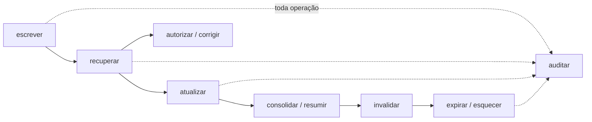
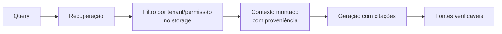
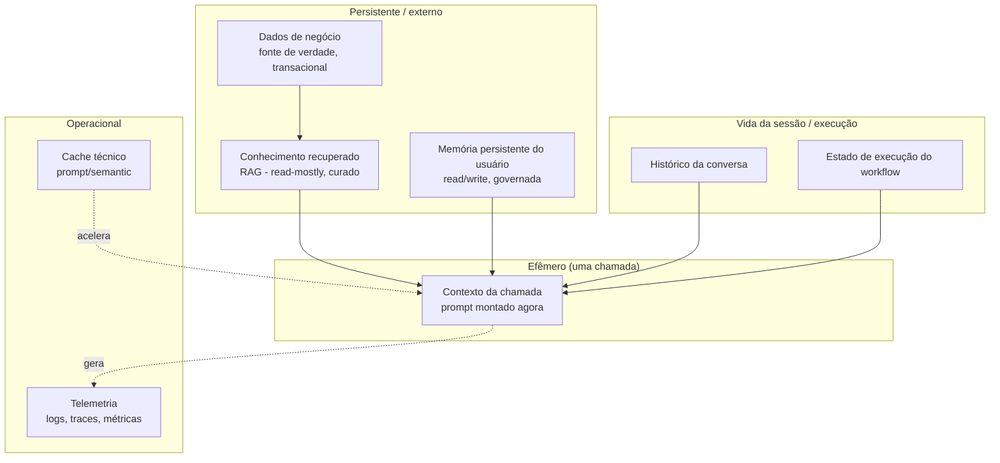

# 🧠 Context Engineering, RAG & Memória

| Data | Apresentador |
|-:|:-|
| 21/06/2026 21:00 | [Ruan Pato](https://ruanpato.com) |

> **Apresentação com observabilidade:** veja o
> [quickstart do Phoenix local](./docs/observabilidade-phoenix.md) para visualizar
> prompts, respostas, embeddings e a árvore de spans das PoCs.

> **Comece aqui:** o [`QUICKSTART.md`](./QUICKSTART.md) permite escolher MOCK,
> `llama3.2:1b` ou `llama3.2:3b`, com ou sem tracing no Phoenix.
> Use `EXPLAIN=1 make poc3` (ou qualquer POC) para ver cartões didáticos no
> terminal: quem chamou o modelo, quais parâmetros entraram, o que foi salvo e onde.

> **Pergunta central:** como montar **contexto útil**, **recuperar conhecimento** e
> manter **memória** sem bagunça nem risco?

Este encontro é deliberadamente **crítico**. Ele não vende vector database como
"memória", não trata RAG como sinônimo de "memória", e não finge que aumentar a
janela de contexto resolve recuperação, seleção e governança. Cada afirmação forte
vem com fonte ao lado, e as falhas aparecem nas demonstrações — não só os
happy paths.

## Sumário

- [🧠 Context Engineering, RAG \& Memória](#-context-engineering-rag--memória)
  - [Sumário](#sumário)
  - [🧭 0. Objetivo, público e como usar este material](#-0-objetivo-público-e-como-usar-este-material)
    - [Objetivo](#objetivo)
    - [Objetivos de aprendizagem](#objetivos-de-aprendizagem)
    - [Pré-requisitos](#pré-requisitos)
    - [Público](#público)
    - [Como usar](#como-usar)
  - [🗂️ 1. Taxonomia: a palavra "memória" é usada de forma vaga](#️-1-taxonomia-a-palavra-memória-é-usada-de-forma-vaga)
    - [O que precisa ficar claro (e a indústria às vezes embaralha)](#o-que-precisa-ficar-claro-e-a-indústria-às-vezes-embaralha)
  - [🧩 2. Context Engineering](#-2-context-engineering)
    - [2.1 O que compõe o contexto efetivo de uma chamada](#21-o-que-compõe-o-contexto-efetivo-de-uma-chamada)
    - [2.2 Context engineering é um problema de oito verbos](#22-context-engineering-é-um-problema-de-oito-verbos)
    - [2.3 Context budget, recência × importância e "lost in the middle"](#23-context-budget-recência--importância-e-lost-in-the-middle)
    - [2.4 Os anti-padrões de contexto](#24-os-anti-padrões-de-contexto)
  - [🧠 3. Memória em sistemas de IA](#-3-memória-em-sistemas-de-ia)
    - [3.1 Operações (o ciclo de vida)](#31-operações-o-ciclo-de-vida)
    - [3.2 Tipos de memória e seus riscos (adaptado de *Eng. de IA em Produção*, cap. 3.6)](#32-tipos-de-memória-e-seus-riscos-adaptado-de-eng-de-ia-em-produção-cap-36)
    - [3.3 Políticas de **escrita**](#33-políticas-de-escrita)
    - [3.4 Políticas de **recuperação**](#34-políticas-de-recuperação)
  - [🔎 4. RAG (Retrieval-Augmented Generation) — recuperar contexto externo](#-4-rag-retrieval-augmented-generation--recuperar-contexto-externo)
    - [4.1 O fluxo essencial](#41-o-fluxo-essencial)
    - [4.2 Grounding e proveniência (o que "estar certo" significa)](#42-grounding-e-proveniência-o-que-estar-certo-significa)
    - [4.3 RAG também falha](#43-rag-também-falha)
    - [⏸️ Pausa de 3–5 min: "Como saber se o RAG está funcionando?"](#️-pausa-de-35-min-como-saber-se-o-rag-está-funcionando)
  - [🧱 5. Contexto × estado × memória](#-5-contexto--estado--memória)
  - [🛡️ 6. Segurança e riscos](#️-6-segurança-e-riscos)
  - [📏 7. Avaliação (a ideia, em 1 minuto)](#-7-avaliação-a-ideia-em-1-minuto)
  - [🧪 8. Demonstrações (POCs)](#-8-demonstrações-pocs)
    - [Por que não usamos um framework de RAG/agente?](#por-que-não-usamos-um-framework-de-ragagente)
  - [🏛️ 9. Discussão arquitetural, exercícios e conclusões](#️-9-discussão-arquitetural-exercícios-e-conclusões)
    - [Perguntas para discussão (leve para o seu sistema)](#perguntas-para-discussão-leve-para-o-seu-sistema)
    - [Exercícios](#exercícios)
    - [Conclusões](#conclusões)
    - [O que ficou de fora (de propósito)](#o-que-ficou-de-fora-de-propósito)
  - [⚙️ 10. Modelos, runtime e compatibilidade](#️-10-modelos-runtime-e-compatibilidade)
    - ["Open weights" ≠ "open source" (e por que isso importa)](#open-weights--open-source-e-por-que-isso-importa)
    - [Matriz de suporte (honesta)](#matriz-de-suporte-honesta)
  - [📚 11. Referências](#-11-referências)
    - [11.1 Fundamentos (contexto, atenção, tokenização)](#111-fundamentos-contexto-atenção-tokenização)
    - [11.2 RAG, retrieval, reranking, híbrido](#112-rag-retrieval-reranking-híbrido)
    - [11.3 GraphRAG](#113-graphrag)
    - [11.4 Memória em agentes e benchmarks](#114-memória-em-agentes-e-benchmarks)
    - [11.5 Segurança (injeção, poisoning)](#115-segurança-injeção-poisoning)
    - [11.6 Avaliação e ferramentas](#116-avaliação-e-ferramentas)
    - [11.7 Runtime e modelos locais](#117-runtime-e-modelos-locais)
    - [11.8 Material complementar do autor](#118-material-complementar-do-autor)

---

## 🧭 0. Objetivo, público e como usar este material

### Objetivo

O problema central **não é "prompt bonito" — é contexto correto.** A narrativa segue,
de propósito, a ordem **Context Engineering → Memória → RAG**: RAG aparece como um
**caso específico** de uma pergunta maior — que informação entra no contexto, de onde
vem, quanto dura, quem pode ver, como é validada e quando deve ser descartada.

Sair com uma **taxonomia rigorosa** e com **intuição de engenharia** para responder,
em sistemas reais, três perguntas que costumam ser confundidas:

1. **O que** colocar no contexto de uma chamada, em que ordem e com qual orçamento?
2. **O que** persistir como memória — e como esquecer, invalidar e auditar?
3. **Como** recuperar conhecimento externo (RAG) de forma relevante, atual e autorizada?

### Objetivos de aprendizagem

Ao final, você deve conseguir:

- [ ] Distinguir, com precisão, **contexto**, **estado**, **conhecimento recuperado** e **memória**.
- [ ] Projetar uma **memória** com operações explícitas (escrever, recuperar, invalidar, expirar, esquecer, auditar).
- [ ] Entender **RAG como recuperação de contexto externo** (fluxo, fontes, grounding, filtro por tenant) — o *retrieval engineering* completo fica na [parte 2](./parte-2-rag-engineering/).
- [ ] Reconhecer riscos (injeção indireta, poisoning, vazamento cross-tenant) e mitigações **parciais**.

### Pré-requisitos

Engenharia de software, APIs/HTTP, noção de LLM (prompt, tokens, janela de contexto).
**Não** exige álgebra linear pesada: usamos cosseno e BM25 no nível de intuição, com
o código à mão. Para rodar as demos: Python 3.10+ e, idealmente, [Ollama](https://ollama.com)
(há um modo `MOCK` que dispensa download — ver [seção 10](#️-10-modelos-runtime-e-compatibilidade)).

### Público

Engenheiros de software, arquitetos e profissionais de IA. O material assume
maturidade técnica e foca em **decisões de engenharia**, não em tutorial de framework.

### Como usar

O encontro alterna **teoria e prática**: cada bloco conceitual tem uma POC associada.
A agenda (60/90/120 min), os tempos e as notas do apresentador estão em
[`ROTEIRO.md`](./ROTEIRO.md). Os slides estão em [`slides/slides.md`](./slides/slides.md);
o PDF é gerado em `.generated/` com `make slides-pdf` e não é versionado.

> **Convenção editorial** (herdada do trabalho do autor em *Engenharia de IA em
> Produção*): distinguimos **evidência** (com citação), **opinião** (decisão de
> engenharia, marcada como tal) e **limite conhecido** (dito no próprio texto).
> Quando uma técnica **não** garante um comportamento, isso aparece explicitamente.

---

## 🗂️ 1. Taxonomia: a palavra "memória" é usada de forma vaga

Em aplicações de IA, "memória" virou guarda-chuva para coisas tecnicamente
diferentes. Antes de qualquer arquitetura, é preciso separar os termos. A tabela
abaixo classifica cada conceito por **origem** — para deixar claro o que vem da
ciência cognitiva, o que é **analogia** de engenharia e o que é **categoria
específica** de sistemas de IA.

| Conceito | O que é, na prática | Onde vive | Origem do termo |
|---|---|---|---|
| **Conhecimento paramétrico** | O que o modelo "sabe" nos pesos, fixado no treino | Pesos do modelo | Categoria de IA |
| **Janela de contexto** | Tokens que o modelo aceita por chamada (prompt+resposta) | Chamada atual | Categoria de IA |
| **Working memory** (memória de trabalho) | Plano, hipóteses e artefatos transitórios do raciocínio atual | Runtime/checkpoint | Analogia (cognição) |
| **Histórico conversacional** | Turnos anteriores da conversa | Runtime, Redis, DB | Categoria de IA |
| **Estado de sessão** | Variáveis da sessão (usuário, carrinho, flags) | Cache/DB de sessão | Engenharia clássica |
| **Memória de curto prazo** | Informação recente, volátil, ligada à tarefa | Runtime, cache | Analogia (cognição) |
| **Memória de longo prazo** | Preferências e fatos que sobrevivem à sessão | SQL, document, vector | Analogia (cognição) |
| **Memória semântica** | Conhecimento estável "sobre o mundo"/domínio | Document, KG | Ciência cognitiva (Tulving) |
| **Memória episódica** | Eventos vividos, com tempo e contexto ("o que aconteceu na sessão X") | Event store, logs | Ciência cognitiva (Tulving) |
| **Memória procedural** | "Como fazer" — rotinas, skills, ferramentas aprendidas | Código, prompts, tools | Ciência cognitiva |
| **Memória externa** | Qualquer store que o sistema lê/escreve fora dos pesos | DB, arquivos, índices | Analogia de engenharia |
| **Cache** | Reaproveitamento técnico de resultados (prompt cache, semantic cache) | KV, Redis | Engenharia clássica |
| **Armazenamento de artefatos** | Arquivos gerados (relatórios, imagens, embeddings) | Object storage | Engenharia clássica |
| **RAG** | Padrão de **recuperar** evidência e injetar no contexto | Índice + pipeline | Categoria de IA |
| **Sumarização/compactação** | Comprimir histórico/contexto para caber na janela | Runtime | Categoria de IA |
| **Estado de workflow** | Posição/variáveis de um fluxo de orquestração | Temporal, DB | Engenharia clássica |
| **Dados persistidos por agentes** | O que um agente decide gravar entre execuções | Vários | Categoria de IA |

A tripartição **semântica / episódica / procedural** vem da psicologia da memória
(Endel Tulving, anos 1970–80) e foi **importada por analogia** para agentes de IA.
A analogia é útil como vocabulário, mas é só analogia: um LLM **não** "lembra" no
sentido cognitivo — ele tem pesos fixos e um contexto efêmero. Tratar a metáfora
como mecanismo é fonte de erro de projeto.

### O que precisa ficar claro (e a indústria às vezes embaralha)

- **RAG não é, automaticamente, memória.** RAG recupera de uma base curada; memória
  implica **escrever, atualizar, invalidar e esquecer** ao longo do tempo. Um RAG
  read-only sobre uma base de documentos não "lembra" do usuário.
- **Histórico de chat não é uma estratégia de memória completa.** É memória de curto
  prazo bruta; sem sumarização, seleção e expiração, ele estoura a janela e degrada.
- **Colocar todo o conteúdo no prompt não é context engineering.** Encher contexto
  costuma ser **pior** do que selecionar bem (ver [seção 2](#-2-context-engineering)).
- **Janela maior não elimina recuperação, seleção e governança.** Mesmo com 1M de
  tokens, alguém precisa decidir o que entra, em que ordem, com qual autorização.
- **Um vector database não resolve, sozinho,** qualidade, segurança, atualização e
  relevância. Ele é uma estrutura de índice — não uma política.
- **Memória sem esquecimento, invalidação e autorização vira passivo.** Dado errado
  ou obsoleto persistido é pior do que não ter memória.
- **"Open source model" e "open-weight model" não são a mesma coisa** (ver
  [seção 10](#️-10-modelos-runtime-e-compatibilidade)).

> **Onde há desacordo na indústria:** os limites entre "working memory", "short-term"
> e "context" são fluidos; cada framework nomeia diferente. Não existe taxonomia
> canônica única. Aqui adotamos a tabela acima como vocabulário **deste encontro** e
> dizemos isso explicitamente, em vez de fingir consenso.

🔗 **Checkpoint 1:** dê um exemplo, do seu sistema, de cada um: contexto, estado,
conhecimento recuperado e memória persistente. Se dois caírem na mesma caixa, vale
revisar a arquitetura.

---

## 🧩 2. Context Engineering

> *Prompt engineering* pergunta "**como** pedir melhor?". *Context engineering*
> pergunta "**o que** merece entrar no contexto, em que ordem, com que formato, com
> que confiança e com qual orçamento?".

### 2.1 O que compõe o contexto efetivo de uma chamada

Tudo isto compete pela mesma janela:

- **System prompt / developer instructions** — papel, escopo, políticas.
- **User input** — a pergunta/tarefa.
- **Tool results** — saídas de ferramentas (e tudo que vem nelas, incluindo lixo).
- **Exemplos** (few-shot), **schemas** (contrato de saída) e **políticas**.
- **Conhecimento recuperado** (RAG) — com proveniência.
- **Histórico** e **working memory** — plano, hipóteses.

Uma forma útil de pensar em **camadas de contexto** (adaptado de *Engenharia de IA em
Produção*, cap. 2.3):

```
1. Normativa        -> system instructions, políticas, escopo
2. Identidade/tenant-> usuário, organização, papéis, permissões
3. Situacional      -> tarefa, parâmetros, histórico recente
4. Operacional      -> tools disponíveis, tool results, checkpoints
5. Cognitiva        -> plano, working memory, hipóteses transitórias
6. Grounding        -> documentos, citações, fatos recuperados (RAG)
7. Contrato de saída-> schema, formato, critérios de sucesso
```

### 2.2 Context engineering é um problema de oito verbos

Não é "escrever um prompt bonito". É:

**seleção · transformação · ordenação · isolamento · autorização · atualização · observabilidade · avaliação.**

| Verbo | Pergunta que ele responde |
|---|---|
| Seleção | O que entra? (relevância × completude) |
| Transformação | Em que forma? (resumo, normalização, dedup) |
| Ordenação | Em que ordem? (recência × importância; *lost in the middle*) |
| Isolamento | O que é instrução e o que é dado não confiável? |
| Autorização | Quem pode ver isto? (tenant, papel) |
| Atualização | Está atual? (obsolescência, invalidação) |
| Observabilidade | Dá para auditar de onde veio? (proveniência) |
| Avaliação | Isto melhorou ou piorou a resposta? |

### 2.3 Context budget, recência × importância e "lost in the middle"

A janela é um limite **duro**: estourá-la causa **truncamento silencioso** — partes
do contexto somem sem aviso, e o modelo "ignora a evidência" sem que ninguém perceba.

Mais grave: **mesmo dentro da janela**, a posição importa. Liu et al. (2023) mostraram
que modelos usam melhor a informação que está no **início** ou no **fim** do contexto
e **degradam** quando a informação relevante está no **meio** — o efeito *lost in the
middle* ([arXiv:2307.03172](https://arxiv.org/abs/2307.03172), acesso em 2026-06-16).
A Anthropic chama o fenômeno geral de degradação com o tamanho de **context rot** e
recomenda **compactação** como primeira alavanca
([Effective context engineering for AI agents](https://www.anthropic.com/engineering/effective-context-engineering-for-ai-agents), acesso em 2026-06-16).

Consequência de engenharia: **selecionar bem > encher**. A [POC1](#-8-demonstrações-pocs)
demonstra ordenação *bookend* (forte no início e no fim) e orçamento explícito.

### 2.4 Os anti-padrões de contexto

- Jogar documentos inteiros no prompt.
- Misturar **instruções** com **dados do usuário** (abre porta para injeção — ver [seção 6](#️-6-segurança-e-riscos)).
- Tool descriptions enormes; histórico infinito.
- Memória sem consentimento; contexto **sem source IDs** (sem proveniência).
- Contexto **contaminado** (um trecho hostil entra como se fosse confiável).
- Contexto **excessivo** (mais tokens, mais custo, mais *lost in the middle*).

🔗 **Checkpoint 2 → POC1.** Rode `make poc1`: a mesma pergunta, dois contextos. O
ingênuo expõe a regra **obsoleta**; o orçado expõe a **vigente** e cita a fonte.

---

## 🧠 3. Memória em sistemas de IA

Memória **não** é "o histórico" nem "o vector DB". É um **sistema** com operações
explícitas e governança. E **memória não é "guardar tudo"**: é seleção, persistência,
recuperação, invalidação, expiração, esquecimento e auditoria.

### 3.1 Operações (o ciclo de vida)



`escrever · recuperar · atualizar · consolidar · resumir · invalidar · expirar ·
esquecer · auditar · autorizar · corrigir`. Memória **sem** as três últimas linhas
(invalidar/expirar/esquecer) vira passivo.

### 3.2 Tipos de memória e seus riscos (adaptado de *Eng. de IA em Produção*, cap. 3.6)

| Tipo | Armazena | Store típico | Risco principal |
|---|---|---|---|
| Short-term | Histórico recente | Runtime, Redis | Overflow de contexto |
| Working | Plano, hipóteses | Runtime, checkpoint | Expor raciocínio sensível |
| Long-term | Preferências, fatos | SQL, document, vector | Privacidade, obsolescência |
| Episódica | Execuções e feedback | Event store, logs | Reaproveitar erro antigo |
| Semântica | Conhecimento estável | Document, KG | Governança ruim |
| Operacional | Estado de workflow | Temporal, DB | Inconsistência |
| Ferramentas | Cache de resultados | Cache, KV | Cache *stale* |

### 3.3 Políticas de **escrita**

- **O que merece ser memorizado:** fatos **confirmados**, não palpites do modelo.
- **Quem pode escrever:** usuário confirmado, tool confiável — não auto-poisoning.
- **Como evitar memórias falsas:** classificar `fato | inferência | palpite`; persistir o primeiro.
- **Conflito:** informação nova confirmada **invalida** a anterior do mesmo tópico.
- **Nível de confiança, proveniência, temporalidade, retenção (TTL), consentimento.**
- **Dados sensíveis:** minimização; respeitar direito de correção/esquecimento.
- **Separação por usuário, organização e tenant** — obrigatória.

### 3.4 Políticas de **recuperação**

- **Similaridade** (não basta), **recência**, **importância**, **frequência**.
- **Contexto atual** — recuperar o que é útil **agora**, não tudo que é parecido.
- **Filtros de autorização** (usuário/tenant) antes de qualquer score.
- **Diversidade** (evitar 5 quase-duplicatas), **limite de tokens**, **thresholds**.
- **Fallback** quando nada é confiável: a resposta certa pode ser "não sei".

> **Estado da arte (com cautela):** *MemGPT* (Packer et al., 2023 —
> [arXiv:2310.08560](https://arxiv.org/abs/2310.08560)) propôs gerenciar memória como
> um SO (paginação entre contexto e store externo). Benchmarks como **LoCoMo**
> (Maharana et al., ACL 2024 — [arXiv:2402.17753](https://arxiv.org/abs/2402.17753))
> medem memória conversacional de longo prazo; sistemas como **Mem0**
> ([arXiv:2504.19413](https://arxiv.org/abs/2504.19413)) reportam ganhos. **Trate
> benchmarks como evidência parcial**, não verdade universal: metodologia, dataset e
> custo importam, e a área muda rápido.

A operação **consolidar** (resumir N episódios em 1 fato) é citada aqui mas fica como
exercício/encontro futuro — memória que só faz *append* não escala.

🔗 **Checkpoint 3 → POC3.** `make poc3`: memória útil recuperada; irrelevante
ignorada; antiga **invalidada**; e "recuperar tudo" produzindo resposta **pior**.

---

## 🔎 4. RAG (Retrieval-Augmented Generation) — recuperar contexto externo

> **RAG é uma extensão prática** das duas ideias anteriores: é como **recuperar
> contexto externo** sob as mesmas regras (proveniência, autorização, atualização,
> orçamento). No encontro principal vemos só o essencial; o aprofundamento de
> *retrieval engineering* está em **[`parte-2-rag-engineering/`](./parte-2-rag-engineering/)**.

RAG (Lewis et al., 2020 — [arXiv:2005.11401](https://arxiv.org/abs/2005.11401)) é um
padrão onde, em vez de confiar só no que o modelo aprendeu, **a aplicação recupera
evidências de uma base e injeta no contexto** antes de gerar:

```text
query -> recuperação(base) -> contexto montado (com fontes) -> LLM -> resposta com citações
```

### 4.1 O fluxo essencial



O que importa entender agora: **de onde** veio cada trecho (proveniência), **quem
pode** vê-lo (filtro por tenant/permissão no *storage*, não no prompt) e se a resposta
está **ancorada** nas fontes. O pipeline completo de ingestão/chunking/embeddings/
indexação/reranking fica na parte 2.

### 4.2 Grounding e proveniência (o que "estar certo" significa)

Três coisas diferentes — não confunda:

- **Resposta plausível** — soa bem.
- **Resposta correta** — bate com a verdade.
- **Resposta suportada (grounded)** — cada afirmação é apoiada por uma **fonte
  recuperada e citável**.

RAG mira a terceira. Por isso pedimos citação por trecho e validamos a fonte — uma
resposta sem fonte recuperada deveria ser "não sei", não um chute confiante.

### 4.3 RAG também falha

- **Não elimina alucinação**; reduz risco **quando** a recuperação é boa.
- **Pode trazer documento errado, obsoleto ou de outro tenant** — e o erro fica pior,
  pois vem ancorado em fonte aparentemente legítima.
- **A maior parte dos problemas está fora do LLM** — na ingestão, no parsing, no índice.

🔗 **Checkpoint 4 → POC2.** `make poc2` (versão compacta): inspecione `query →
candidatos → escolhidos → contexto → resposta → fontes`, e `make leak` para ver o
**vazamento cross-tenant** quando o filtro é desligado.

### ⏸️ Pausa de 3–5 min: "Como saber se o RAG está funcionando?"

> Antes de confiar em um RAG, eu separo avaliação em **três camadas**: o *retriever*
> achou os documentos certos? O *contexto montado* colocou evidência suficiente e pouco
> ruído? A *resposta final* ficou fiel ao contexto? Não basta a resposta parecer boa —
> ela precisa estar **correta, relevante e suportada** pelas fontes recuperadas.

Isto é só o gancho. Métricas formais (recall@k, context precision/recall,
faithfulness), golden set e regressão de qualidade ficam na **parte 2**.

> **Aprofundamento → [`parte-2-rag-engineering/`](./parte-2-rag-engineering/):**
> embeddings e dimensionalidade (Matryoshka, thresholds por modelo), chunking e
> *index versioning*, dense/lexical/BM25, híbrido/RRF, MMR/diversidade, reranking ×
> cross-encoder, *permission-aware retrieval*, RAG evaluation em camadas,
> observabilidade (query/chunks/scores/fontes/versão do índice/top-k/latência/custo),
> OWASP **LLM08** e GraphRAG. É a base para um possível **segundo encontro**.

---

## 🧱 5. Contexto × estado × memória

A confusão entre estes conceitos é a causa-raiz de muitos bugs. Cada um tem dono,
ciclo de vida e fronteira de segurança diferentes.



| Dimensão | Contexto | Estado de workflow | Histórico | Conhecimento (RAG) | Memória | Cache | Dados de negócio | Telemetria |
|---|---|---|---|---|---|---|---|---|
| Dono | App | Orquestrador | App | Curadoria/KB | Sistema de memória | Infra | Domínio | Observabilidade |
| Ciclo de vida | 1 chamada | 1 execução | 1 sessão+ | Versão do índice | Longo, com TTL | Curto, TTL | Permanente | Retenção definida |
| Escrita | Montado | Pelo runtime | Append | Reindex | Política de escrita | Automática | Transacional | Append |
| Fronteira de segurança | Isolar instrução×dado | Por execução | Por sessão/usuário | Por tenant no storage | Por usuário/tenant | Por chave/versão | IAM/ABAC | PII redigida |
| Fonte de verdade? | Não | Não | Não | Não (cópia) | Não (derivada) | Não | **Sim** | Não |

**Regra prática:** se você não consegue dizer em qual destas caixas um dado está, você
não consegue dizer quem pode lê-lo, quando ele expira, nem de onde ele veio.

---

## 🛡️ 6. Segurança e riscos

Segurança não é o tema principal deste encontro, mas é **inseparável** dele — e faz a
ponte com o próximo tema do grupo: **Segurança, Guardrails & Autorização**.

| Risco | O que é | Mitigação **parcial** |
|---|---|---|
| **Indirect prompt injection** | Documento recuperado contém instruções que o modelo obedece | Demarcar dado não confiável; instruir; **limitar blast radius** depois do modelo |
| **Knowledge/vector poisoning** | Documento malicioso/ruidoso entra no índice | Ingestão com validação, provenance, aprovação de fontes novas |
| **Memória falsa/incorreta** | Palpite ou dado errado persistido e reusado | Classificar `fato/inferência`; confirmar; TTL; validar contra fonte |
| **Vazamento cross-tenant** | Pergunta de um cliente recupera dado de outro | **Filtro por tenant no storage**, não no prompt |
| **Recuperação sem autorização** | Acesso a documento que o usuário não poderia ver | RBAC/ABAC no retriever; filtros obrigatórios |
| **Persistência de dado sensível** | PII guardada além do necessário | Minimização; retenção; direito ao esquecimento implementado |
| **Propagação de obsoleto** | Versão antiga ainda indexada vence a nova | Metadados de validade; reindex; invalidação |
| **Tool output contaminando memória** | Saída de ferramenta vira "fato" | Provenance; não persistir output bruto como fato |
| **Blast radius de memória compartilhada** | Uma memória ruim afeta muitos | Segmentação; menor escopo possível |

> **A verdade incômoda:** **não existe defesa completa para prompt injection** no
> estado atual (Greshake et al., 2023 —
> [arXiv:2302.12173](https://arxiv.org/abs/2302.12173); OWASP **LLM01:2025** —
> [Top 10 for LLM Apps](https://owasp.org/www-project-top-10-for-large-language-model-applications/),
> acesso em 2026-06-16). A indireta — via documento recuperado — é o vetor de
> produção. A postura defensável é **assumir que vai acontecer** e desenhar para que o
> **blast radius** seja pequeno: autorização, *policy-as-code*, HITL para ações
> críticas, egress restrito. O OWASP 2025 inclusive criou a categoria **LLM08 — Vector
> and Embedding Weaknesses**, reconhecendo que RAG é **superfície de ataque**, não escudo.

🔗 **Checkpoint 5 → POC4.** `make poc4`: a injeção indireta é obedecida no pipeline
ingênuo; demarcação + guarda de saída **reduzem** — mas o documento envenenado
**continua sendo recuperado**. Mitigar injeção não conserta o retrieval.

---

## 📏 7. Avaliação (a ideia, em 1 minuto)

A regra que fica: avaliar este tipo de sistema é avaliar um **pipeline, etapa por
etapa** — não só "a resposta final pareceu boa". No mínimo, em três camadas:

1. **Retriever** — achou os documentos certos?
2. **Contexto montado** — colocou evidência suficiente e pouco ruído?
3. **Resposta final** — ficou **fiel** (grounded) ao contexto?

E o mesmo vale para **memória**: a memória certa foi recuperada? houve **falso
positivo**? alguma importante **não** foi recuperada? (ver POC3.)

Os [testes](./tests/) deste encontro são o exemplo reprodutível: `make test` valida
filtro por tenant (fail-closed), invalidação de memória e comportamento sob injeção —
em modo **MOCK**, sem baixar modelo.

> **Métricas formais** (recall@k, context precision/recall, faithfulness, nDCG@k),
> **golden set** e **regressão de qualidade** ao mudar chunking/embedding/top-k/prompt
> ficam na **[parte 2](./parte-2-rag-engineering/)** — o encontro principal **não** é
> aula de métricas, e nenhuma métrica isolada "resolve" qualidade.

---

## 🧪 8. Demonstrações (POCs)

Quatro POCs **inspecionáveis**, distribuídas ao longo do encontro na ordem da
narrativa (Context → Memória → RAG → Falha), **não tudo no fim**. Sem LangChain/
LlamaIndex: chunking, cosseno, BM25 e RRF estão à mão em
[`demos/common/`](./demos/common/). Detalhes e saídas esperadas em cada README.

| Ordem | POC | Demonstra | Comando |
|---|---|---|---|
| após §2 | [**1. Context Assembly**](./demos/poc1_context_assembly/) | Montagem ingênua × com orçamento/critérios | `make poc1` |
| após §3 | [**3. Memória**](./demos/poc3_memory/) | Lifecycle: write/retrieve/invalidate/expire/forget | `make poc3` |
| após §4 | [**2. RAG**](./demos/poc2_rag/) (compacta) | Fluxo visível; fontes; **filtro por tenant** | `make poc2` / `make demo` |
| na §6 | [**4. Falha**](./demos/poc4_failure/) | Injeção indireta via RAG + mitigação parcial | `make poc4` |

> A numeração das pastas (`poc1..poc4`) é histórica; a **ordem de apresentação** segue
> a tabela acima. O *deep dive* de retrieval da POC2 (BM25/RRF/rerank/eval) está em
> [`parte-2-rag-engineering/`](./parte-2-rag-engineering/).

Cada POC roda com **modelo local** (Ollama) ou em **MOCK** determinístico
(`USE_MOCK=1`) — ver [seção 10](#️-10-modelos-runtime-e-compatibilidade).

### Por que não usamos um framework de RAG/agente?

Porque o objetivo é **ensinar o conceito**, não esconder. Quando você usa um framework,
saiba responder: (a) qual problema ele resolve; (b) quais abstrações ele introduz; (c)
o que aconteceria sem ele; (d) quais são os lock-ins. Em produção, um vector DB
(Qdrant/Chroma/pgvector) e um reranker dedicado fazem sentido — aqui eles
**atrapalhariam o aprendizado**.

---

## 🏛️ 9. Discussão arquitetural, exercícios e conclusões

### Perguntas para discussão (leve para o seu sistema)

1. Estamos ensinando/usando **memória** ou apenas **persistindo mensagens**?
2. Recuperamos algo porque é **semelhante** ou porque é **realmente útil agora**?
3. A arquitetura tem estratégia de **invalidação** e **esquecimento**?
4. Existe risco de **vazamento entre usuários/tenants**? O filtro está no storage?
5. O corpus permite **demonstrar erros reais** de retrieval, ou só o happy path?
6. Onde a fronteira **instrução × dado não confiável** está desenhada?

### Exercícios

- **E1 (fácil):** adicione um documento ao [corpus](./demos/corpus/) e uma query no
  golden set; rode `make poc2` e veja se ele é recuperado.
- **E2 (médio):** implemente a operação **consolidar** na [POC3](./demos/poc3_memory/)
  (resumir N episódios em 1 fato) e escreva um teste.
- **E3 (médio):** adicione um **rerank** por LLM-as-reranker na [POC2](./demos/poc2_rag/)
  e meça se Precision@k melhora no golden set.
- **E4 (difícil):** crie um payload de injeção **novo** para a [POC4](./demos/poc4_failure/)
  que contorne a demarcação; proponha (e discuta os limites de) uma mitigação.

### Conclusões

- **O problema não é prompt — é contexto.** Correto, suficiente, atualizado,
  autorizado, verificável e bem posicionado.
- **Memória exige esquecimento.** Sem invalidar/expirar/auditar, é passivo.
- **RAG é recuperação de contexto externo** — um caso da pergunta maior; é um pipeline
  que falha **fora** do LLM.
- **Seleção > acúmulo.** Mais contexto raramente é melhor.
- **Não há bala de prata** — nem GraphRAG, nem long-context, nem "mais um framework".

### O que ficou de fora (de propósito)

- **Conteúdo principal:** Context Engineering → Memória → RAG (essencial) + falhas.
- **Extensão (possível 2º encontro):** todo o *retrieval engineering* — embeddings,
  chunking, dense/lexical/híbrido, RRF, MMR, reranking, RAG evaluation, observabilidade
  e GraphRAG — está preparado em
  [`parte-2-rag-engineering/`](./parte-2-rag-engineering/).
- **Apêndice/escrito:** nota crítica de Obsidian
  ([docs/obsidian-critico.md](./docs/obsidian-critico.md)).
- **Encontro futuro:** Segurança/Guardrails & Autorização (tema 2); memória de agentes
  (MemGPT/LoCoMo) com benchmark próprio.

---

## ⚙️ 10. Modelos, runtime e compatibilidade

Detalhes completos em [`docs/matriz-compatibilidade.md`](./docs/matriz-compatibilidade.md)
e [`docs/decisoes-e-limitacoes.md`](./docs/decisoes-e-limitacoes.md). Resumo:

- **Runtime:** [Ollama](https://github.com/ollama/ollama) (CPU-only, simples, Apple
  Silicon/Linux/Windows-WSL2). Alternativa: **Docker Compose** ([docker/](./docker/)).
  **Fallback:** `MOCK` determinístico (`USE_MOCK=1`) — valida pipeline sem download,
  **não substitui** a execução real.
- **Embeddings:** `nomic-embed-text` — **Apache-2.0, pesos e dados abertos** (Nussbaum
  et al., 2024 — [arXiv:2402.01613](https://arxiv.org/abs/2402.01613)), ~274 MB, 768
  dimensões, rápido em CPU. É o nosso exemplo de **open source de verdade**.
- **Geração:** `llama3.2:3b` (~2 GB) por padrão; `llama3.2:1b` (~1.3 GB) para ≤8 GB de RAM.

### "Open weights" ≠ "open source" (e por que isso importa)

Llama 3.2 tem **pesos abertos**, mas é distribuído sob a **Llama Community License** —
com restrições (ex.: cláusula de 700 milhões de usuários ativos mensais) e política de
uso aceitável. Isso **não** é uma licença open source no sentido OSI. Já
`nomic-embed-text` é **Apache-2.0** (sem essas restrições) e ainda publica dados de
treino. Usamos os dois de propósito: o contraste é o **momento didático**. Antes de
adotar qualquer modelo "aberto", **leia a licença** — não confie no rótulo.

### Matriz de suporte (honesta)

| Ambiente | Caminho principal | Observação |
|---|---|---|
| macOS Apple Silicon | Ollama nativo | melhor experiência; testado |
| Linux x86_64 | Ollama nativo ou Docker | CPU-only ok |
| Windows | WSL2 ou Docker Desktop | sem teste nativo Windows aqui |
| CPU-only, ~8 GB RAM | `llama3.2:1b` + nomic | 3b aperta; 1b confortável |
| Sem internet/baixar | `USE_MOCK=1` | valida pipeline, não é demo real |

Download do caminho padrão ≈ **2,3 GB** (3b) ou **1,6 GB** (1b). Tempos reais de
preparo e execução estão registrados em
[`docs/decisoes-e-limitacoes.md`](./docs/decisoes-e-limitacoes.md).

---

## 📚 11. Referências

Priorizamos **papers, specs e documentação oficial**. Cada item foi verificado; data
de acesso geral: **2026-06-16**.

### 11.1 Fundamentos (contexto, atenção, tokenização)

- Vaswani et al., *Attention Is All You Need* (2017) — <https://arxiv.org/abs/1706.03762>
- Liu et al., *Lost in the Middle: How Language Models Use Long Contexts* (TACL 2023) — <https://arxiv.org/abs/2307.03172>
- Anthropic, *Effective context engineering for AI agents* (2025) — <https://www.anthropic.com/engineering/effective-context-engineering-for-ai-agents>

### 11.2 RAG, retrieval, reranking, híbrido

- Lewis et al., *Retrieval-Augmented Generation for Knowledge-Intensive NLP Tasks* (NeurIPS 2020) — <https://arxiv.org/abs/2005.11401>
- Karpukhin et al., *Dense Passage Retrieval for Open-Domain QA* (EMNLP 2020) — <https://arxiv.org/abs/2004.04906>
- Robertson & Zaragoza, *The Probabilistic Relevance Framework: BM25 and Beyond* (Foundations and Trends in IR, 2009) — DOI <https://doi.org/10.1561/1500000019>
- Cormack, Clarke & Büttcher, *Reciprocal Rank Fusion outperforms Condorcet and individual Rank Learning Methods* (SIGIR 2009) — DOI <https://doi.org/10.1145/1571941.1572114>
- Nussbaum et al., *Nomic Embed: Training a Reproducible Long Context Text Embedder* (2024) — <https://arxiv.org/abs/2402.01613>

### 11.3 GraphRAG

- Edge et al. (Microsoft Research), *From Local to Global: A Graph RAG Approach to Query-Focused Summarization* (2024) — <https://arxiv.org/abs/2404.16130>
- Microsoft GraphRAG (docs) — <https://microsoft.github.io/graphrag/>

### 11.4 Memória em agentes e benchmarks

- Packer et al., *MemGPT: Towards LLMs as Operating Systems* (2023) — <https://arxiv.org/abs/2310.08560>
- Maharana et al., *Evaluating Very Long-Term Conversational Memory of LLM Agents* (LoCoMo, ACL 2024) — <https://arxiv.org/abs/2402.17753>
- Chhikara et al., *Mem0: Building Production-Ready AI Agents with Scalable Long-Term Memory* (2025) — <https://arxiv.org/abs/2504.19413>
- Quek et al., *MeMo: Memory as a Model* (2026) — <https://arxiv.org/abs/2605.15156>
- Tulving, *Episodic and Semantic Memory* (1972) — base cognitiva da distinção semântica/episódica.

### 11.5 Segurança (injeção, poisoning)

- Greshake et al., *Not What You've Signed Up For: Compromising Real-World LLM-Integrated Applications with Indirect Prompt Injection* (2023) — <https://arxiv.org/abs/2302.12173>
- OWASP, *Top 10 for LLM Applications 2025* (LLM01 Prompt Injection, LLM08 Vector & Embedding Weaknesses) — <https://owasp.org/www-project-top-10-for-large-language-model-applications/>

### 11.6 Avaliação e ferramentas

- Ragas, *Metrics* (docs) — <https://docs.ragas.io/en/stable/concepts/metrics/>
- TruLens, *RAG Triad of metrics* — <https://www.trulens.org/getting_started/core_concepts/rag_triad/>

### 11.7 Runtime e modelos locais

- Ollama (repositório + API) — <https://github.com/ollama/ollama>
- Meta, *Llama 3.2 license* (community, open weights) — <https://www.llama.com/llama3_2/license/>

### 11.8 Material complementar do autor

- Ruan Pato, *Engenharia de IA em Produção* (handbook em construção) — caps. 2.3
  (context engineering), 2.6–2.10 (RAG), 3.6 (memória), 4.3/4.5 (injeção e poisoning),
  5.4 (eval harness). Repositório `production-ai-engineering`.

> Citações sustentam **claims**; opiniões de engenharia estão marcadas como tal;
> benchmarks são tratados como evidência **parcial**. Se um link quebrar, abra issue —
> não tratamos referência como decoração.
